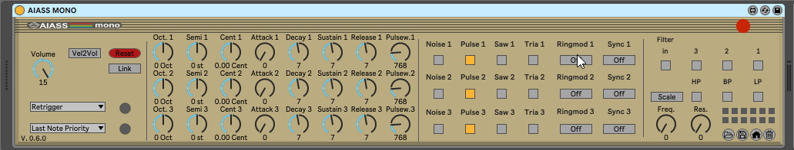

# AIASS Is A SID Synthesizer (for MAX4LIVE)

## SIDBlaster-USB Control Plugin for Ableton Live
#### Programming and UI design by Andreas Schumm
#### Documentation and Sounddesign by Magnus Hansson
The AIASS, together with Sidblaster-USB hardware, allows to produce music with an original SID chip MOS 6581 or MOS 8580 from the Commodore 64, in a modern DAW.

see the [manual](https://github.com/gh0stless/AIASS-for-MAX4LIVE/tree/master/Documentation) or the [wiki](https://github.com/gh0stless/AIASS-for-MAX4LIVE/wiki) for instructions

see: [sid-object](https://github.com/gh0stless/sid-object/) for the Max/MSP extention thats used.

see: [SIDBlaster-USB-Tic-Tac-Edition](https://github.com/gh0stless/SIDBlaster-USB-Tic-Tac-Edition) for SIDBlaster-USB hardware.

see: [SIDBlasterUSB_HardSID-emulation-driver](https://github.com/Galfodo/SIDBlasterUSB_HardSID-emulation-driver) for hardsid.dll.

see: [AIASS-Mono-VST](https://github.com/gh0stless/AIASS-Mono-VST) for the VST variant of the AIASS.

Thanks to:

*Stein Pedersen and Wilfred Bos for there support.

*Ken Händel for the linux/mac port of the hardsid library.

##### Copyright © 2022 [www.crazy-midi.de](http://www.crazy-midi.de)

Andreas Schumm (gh0stless)
contact: info@crazy-midi.de

